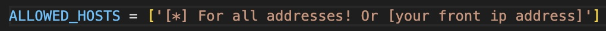

# My final Jhon Bryce project commerce app

**in order to set up the app you will also need to set up the front-end part of the project**
you can do that here: https://github.com/BakalMode/supermarket-front-JB-Final-Project

## Setting up instructaions: (without using docker)

creating a virtual environment:                                                                
**!!check if one already exists before creating a new one!!**
-      python -m virtualenv myenv

activate the virtual environment:
Windows:                                                                                                                                
-      myenv\Scripts\activate
macOS/Linux:                                                                                                                            
-      source myenv/bin/activate

if activated currectly the virtual environment should appear like so:                                       

                                                                                                            
installing the requirements.txt file:                                                               
so all the requiered packages will be installed in your virtual environment
-      pip install -r requirements.txt

run this commad to start the server:
-      python manage.py runserver

and setting up the allowed hosts in settings.py:
["*"] for all hosts and ["your front end server"] for a proper setup

